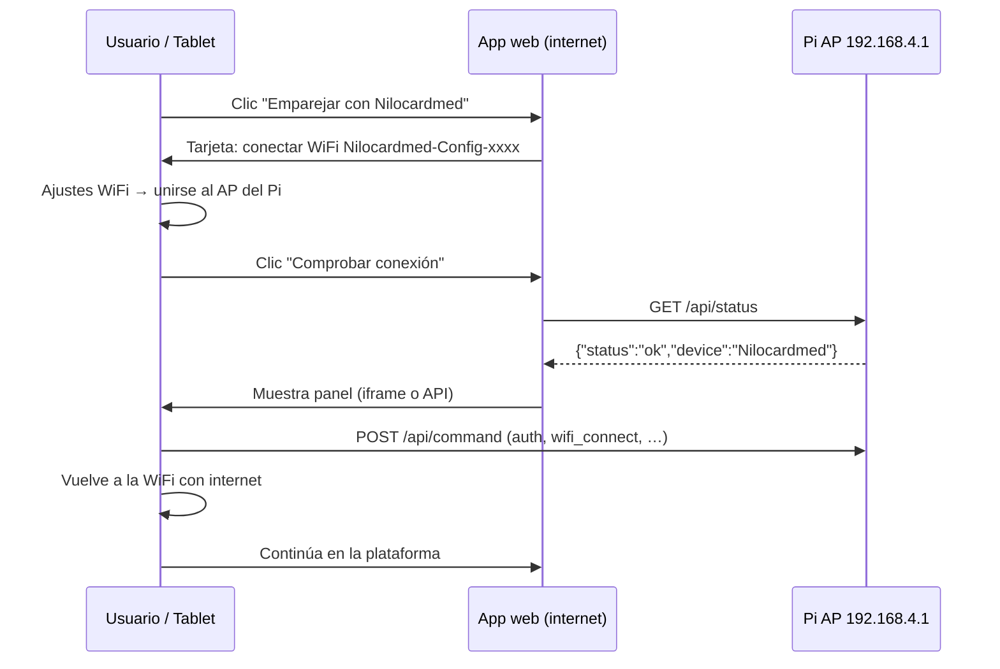

# Integración frontend — NiloCardmed vía WiFi AP local

Documento para el equipo de **Frontend** sobre el flujo de emparejamiento y configuración del dispositivo **NiloCardmed** (Raspberry Pi Zero 2 W) usando **WiFi** en lugar de Bluetooth.

> **Nota:** El código Bluetooth permanece en el repositorio pero está **desactivado por defecto** (`BLUETOOTH_ENABLED=false`). Este documento sustituye al flujo Web Bluetooth para producción.

---

## 1. Resumen del modelo

| Aspecto | Detalle |
|---------|---------|
| Seguridad física | La tablet debe unirse al AP del dispositivo (`Nilocardmed-Config-xxxx`) |
| Red STA del Pi | `wlan0` permanece conectada a la red del MiniPC (producción) |
| Red AP del Pi | `uap0` emite AP permanente en `192.168.4.1/24` |
| Servidor local | HTTP en `http://192.168.4.1:8080` |
| Protocolo | Mismo JSON de comandos que BLE (`auth`, `wifi_scan`, `wifi_connect`, …) |
| Canal AP | Mismo canal WiFi que la STA (limitación hardware Pi) |

---

## 2. Flujo de usuario en la app web principal



### Paso 1 — Pantalla de emparejamiento

Mostrar una tarjeta vacía con instrucciones:

1. Abrir **Ajustes → WiFi** en la tablet.
2. Conectar a la red **`Nilocardmed-Config-xxxx`** (xxxx = últimos 4 hex de la MAC del Pi; visible en etiqueta o lista WiFi).
3. Volver a la app y pulsar **Comprobar conexión**.

No intentar `fetch` a `192.168.4.1` hasta que el usuario haya cambiado de red (la petición fallará mientras esté en otra WiFi).

### Paso 2 — Validación de conexión

```javascript
const DEVICE_API = 'http://192.168.4.1:8080';

async function checkDeviceReachable() {
  try {
    const res = await fetch(`${DEVICE_API}/api/status`, {
      method: 'GET',
      cache: 'no-store',
    });
    if (!res.ok) throw new Error(`HTTP ${res.status}`);
    const data = await res.json();
    return data.status === 'ok';
  } catch {
    return false;
  }
}
```

Si devuelve `true`, mostrar el panel de configuración. Si no, mensaje:

> «Dispositivo fuera de alcance o tablet no conectada a Nilocardmed-Config-xxxx»

### Paso 3 — Panel de configuración

**Opción A — iframe (rápida):**

```html
<iframe
  src="http://192.168.4.1:8080/"
  title="Configuración NiloCardmed"
  style="width:100%;min-height:480px;border:1px solid #ccc"
></iframe>
```

El Pi sirve una página HTML mínima con formulario de auth + WiFi.

**Opción B — API JSON (integrada en la PWA):**

Usar los endpoints documentados abajo y renderizar UI propia.

### Paso 4 — Retorno a internet

Tras guardar cambios, indicar al usuario que vuelva a la **WiFi del MiniPC / internet**. La configuración remota del dispositivo **no es posible** sin estar en el AP local.

---

## 3. API HTTP local

Base URL (solo accesible en la red AP): **`http://192.168.4.1:8080`**

### GET `/api/status`

Comprobación de salud (sin autenticación).

**Respuesta 200:**

```json
{
  "status": "ok",
  "device": "Nilocardmed",
  "device_name": "NiloCardmed-a1b2c3d4",
  "version": "0.x.x"
}
```

### GET `/api/config`

Resumen de configuración (sin secretos). Sin autenticación.

```json
{
  "device_name": "NiloCardmed-a1b2c3d4",
  "wifi": { "ssid": "MiniPC-WiFi", "connected": true },
  "cardmed": { "site_id": "...", "enabled": true },
  "sampling": { "enabled": true, "interval_seconds": 60 }
}
```

### GET `/api/dashboard`

Panel agregado para la pestaña **Estado** (sin autenticación; solo accesible en el AP).

Incluye en una sola respuesta: WiFi en vivo, alimentación (`power.display_percent`, `power.source_label`), sampling, cámara, contadores de capturas, CardMed resumido y `config_last_saved_at`.

Equivalente autenticado: comando `device_status` vía `POST /api/command`.

Comandos adicionales para la UI v2: `camera_get_device`, `camera_set_device`, `cardmed_scan_qr`, `cardmed_configure` con `config_code` / `config_json`.

Briefing UI detallado: **`docs/MENSAJE_AGENTE_FRONTEND_WIFI_UI.md`**.

### POST `/api/command`

Mismo contrato JSON que BLE GATT.

**Cuerpo:**

```json
{
  "cmd": "auth",
  "id": "req-1",
  "payload": { "password": "..." }
}
```

**Respuesta:**

```json
{
  "ok": true,
  "cmd": "auth",
  "id": "req-1",
  "data": { "token": "...", "expires_in": 3600 }
}
```

Comandos siguientes: incluir header `Authorization: Bearer <token>` o campo `"token"` en el JSON.

Comandos disponibles (igual que BLE): `auth`, `ping`, `wifi_scan`, `wifi_status`, `wifi_connect`, `cardmed_get`, `cardmed_configure`, `health_status`, etc. Ver `docs/BLUETOOTH_PROTOCOL.md`.

### CORS

El servidor envía `Access-Control-Allow-Origin: *` para permitir `fetch` desde la PWA cargada por HTTPS mientras la tablet está en el AP del Pi.

---

## 4. Ejemplo mínimo (React / vanilla)

```javascript
const API = 'http://192.168.4.1:8080';
let token = sessionStorage.getItem('nilocardmed_token') || '';

async function command(cmd, payload = {}) {
  const res = await fetch(`${API}/api/command`, {
    method: 'POST',
    headers: {
      'Content-Type': 'application/json',
      ...(token ? { Authorization: `Bearer ${token}` } : {}),
    },
    body: JSON.stringify({ cmd, payload }),
  });
  const data = await res.json();
  if (cmd === 'auth' && data.ok && data.data?.token) {
    token = data.data.token;
    sessionStorage.setItem('nilocardmed_token', token);
  }
  return data;
}

// Flujo típico tras conectar al AP:
await command('auth', { password: userPassword });
await command('wifi_scan');
await command('wifi_connect', { ssid: 'MiniPC-WiFi', password: wifiPassword });
```

---

## 5. Variables de entorno (referencia)

| Variable | Default | Descripción |
|----------|---------|-------------|
| `BLUETOOTH_ENABLED` / `ENABLE_BLUETOOTH` | `false` | BLE legacy off |
| `ENABLE_WIFI_AP` | `true` | AP concurrente uap0 |
| `WIFI_AP_SSID_PREFIX` | `Nilocardmed-Config` | Prefijo SSID |
| `WIFI_AP_IP` | `192.168.4.1` | Gateway del AP |
| `NILOCARDMED_HTTP__ENABLED` | `true` | Servidor HTTP en el contenedor |
| `NILOCARDMED_HTTP__PORT` | `8080` | Puerto local |
| `NILOCARDMED_CONNECTION_PASSWORD` | (install) | Contraseña de `auth` (HTTP y BLE legacy) |

---

## 6. Reactivar Bluetooth (rescate)

Sin eliminar código:

1. En `deploy.env`: `BLUETOOTH_ENABLED=true`, `ENABLE_BLUETOOTH=true`
2. En `.env`: `NILOCARDMED_BLUETOOTH__ENABLED=true`
3. Opcional: `NILOCARDMED_HTTP__ENABLED=false`, `ENABLE_WIFI_AP=false`
4. `sudo ./scripts/update.sh`

---

## 7. Comprobación en dispositivo

```bash
# AP activo
systemctl status nilocardmed-wifi-ap
iw dev uap0 info

# API local (desde tablet o Pi conectada al AP)
curl -s http://192.168.4.1:8080/api/status

# BLE desactivado (no debe haber GATT en logs)
sudo docker logs nilocardmed 2>&1 | grep -i bluetooth
```

---

## 8. Limitaciones conocidas

1. **AP y STA comparten canal** — el AP usa el mismo canal que `wlan0`.
2. **Sin internet en el AP** — la tablet pierde internet mientras está en `Nilocardmed-Config-xxxx`; la PWA debe funcionar offline o recargar al volver.
3. **Puerto 8080 local** — distinto del SER backend; `NILOCARDMED_SER__URL` apunta al MiniPC, no a la Pi.
4. **iOS / Safari** — el flujo WiFi funciona; no depende de Web Bluetooth.

---

Documento relacionado (legacy): [`Integracion_Frontend.md`](Integracion_Frontend.md) (Web Bluetooth).
